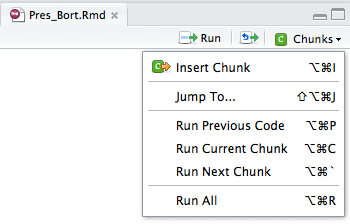
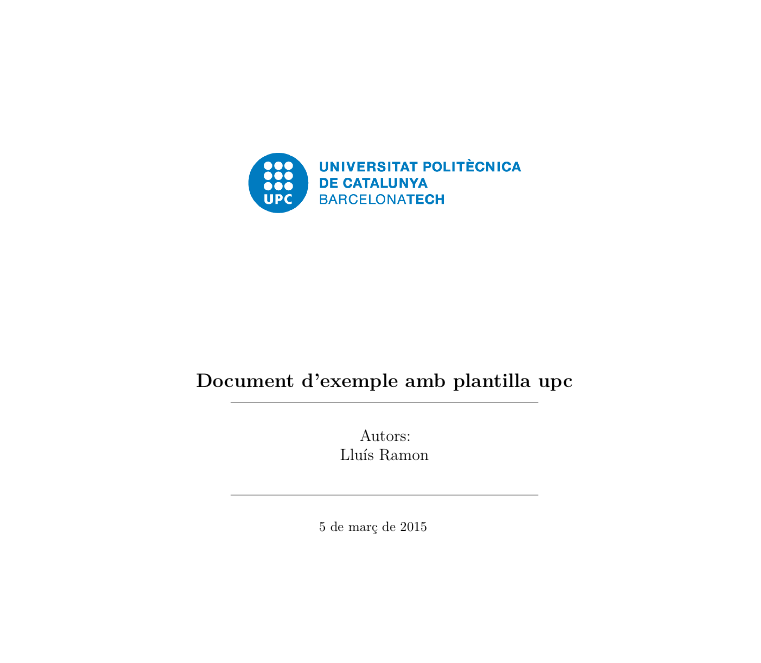
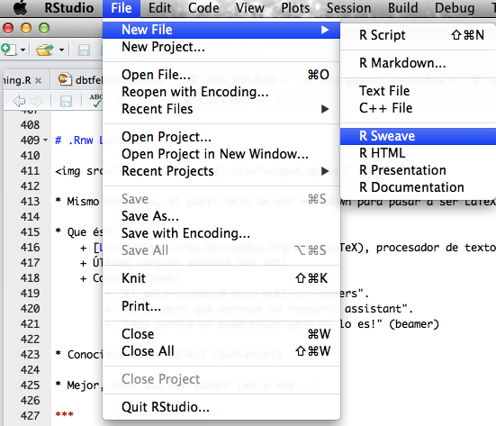
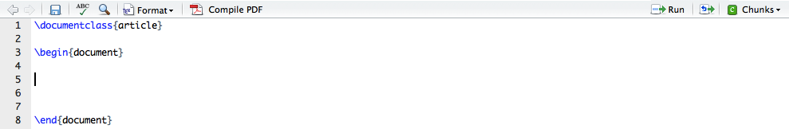
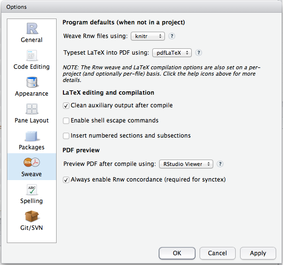
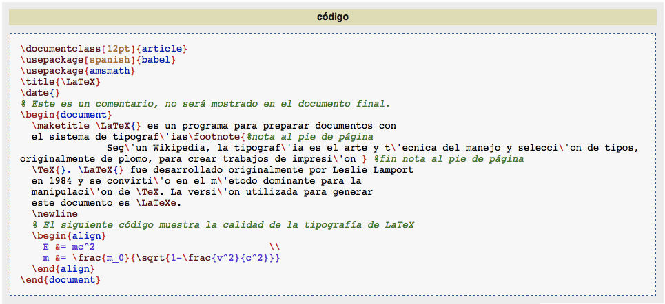
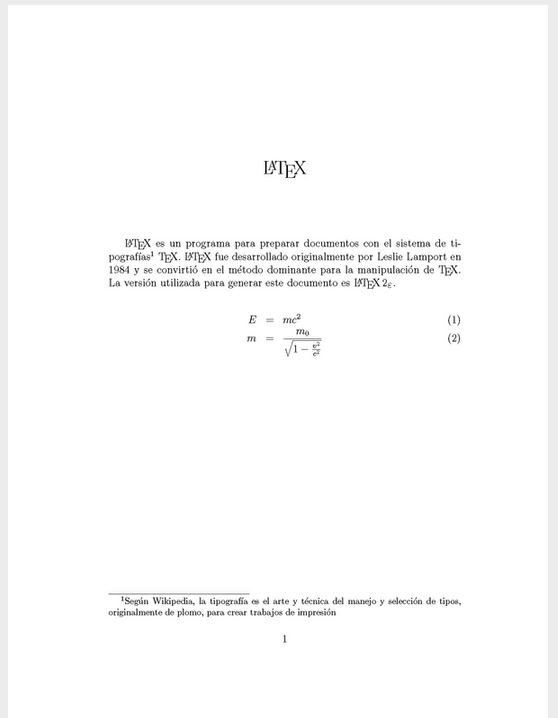
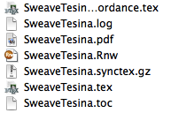
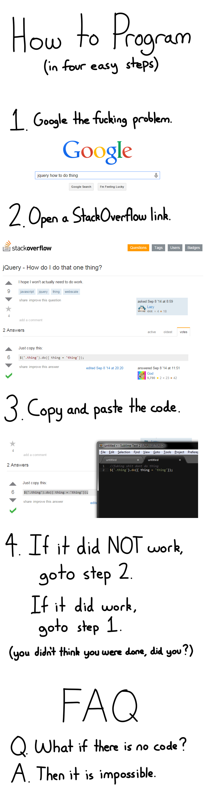

# Motivación

<br>

### Automatizar

* Menos tiempo en informes periodicos
* Adaptar documentos parecidos
* Rapidez

### Reproducible

* Mas fácil encontrar errores
* Mas fácil recordar detalles del documento
* Sin errores de cortar y pegar

### Diferentes formatos

* word, pdf, html
* presentaciones

<!-- 

* Control de versiones con git
* Fácil de añadir comentarios

-->

# Ejemplo

<br>

1. Data preparation
2. Modeling
3. Generating report
4. Something wrong in your data
5. Repeat 1 ~ 4

<br>
<br>


<div class="footnote">
<p>Slide copiada de <a href = "http://rpubs.com/mansun_kuo/24330">Mansun Kuo</a></p>
</div>

# Conceptos

<br>

* __LaTeX__: centrado en el contenido y no la estética
* __markdown__: markup language para páginas web
* __Sweave__: genera informes LaTeX con cálculos en R
* __knitr__: actualización de Sweave más flexible y general 
* __pandoc__: transforma entre markup languages
* __rmarkdown__: genera documentos markdown con cálculos en R

# Requisitos

<br>

### Versiones de R y RStudio actualitzadas:

* [R (>= 3.0)](http://cran.r-project.org/)
* [RStudio (>= 0.98.1089)](http://www.rstudio.com/products/rstudio/download/)
* Si no usamos RStudio [pandoc (>= 1.12.3)][] 

[pandoc (>= 1.12.3)]: http://johnmacfarlane.net/pandoc/

### Los siguientes packages de R:

* knitr 1.8
* rmarkdown (>= 0.4.2)

### Una distribución de TeX

* [TexLive](https://www.tug.org/texlive/acquire-netinstall.html)
* [MacTeX](https://tug.org/mactex/)
* [MikTeX](http://miktex.org/)

# Ejercicio 1: Generar el primer documento

<br>

<div class="columns-2">


</div>


# Markdown basics

<br>

```markdown
# Nivel 1 
## Nivel 2
### Nivel 3

*cursiva*   **negrita**
_cursiva_   __negrita__

[link](https://rugbcn.wordpress.com/)

* lista de elementos
* elemento 2
 + elemento 2.1
 + elemento 2.2
* elemento 3

Formulas en formato LaTeX van entre dolares $\beta^2$

<!-- Comentario en Markdown basics -->
```

***

<br>

<div class="columns-2">
<a href="http://www.rstudio.com/wp-content/uploads/2015/02/rmarkdown-reference.pdf">

</a>


</div>


# Document Templates

<br>

<div class="columns-2">
<a href="http://www.rstudio.com/wp-content/uploads/2015/02/rmarkdown-reference.pdf">

</a>

</div>


# Ejercicio 2: Customizar el documento

<br>

* Añadir un nivel
* Añadir un segundo nivel
* Añadir una lista o una fórmula en LaTeX
* Añadir un comentario
* Crear un word y un pdf

# Opciones de las templates

<br>


# Corrector ortográfico

<br>

<div class="columns-2">


</div>

# Knitr
## Que és?

* Es el paquete que nos facilita la integración del código R a LaTeX o Markdown.
    + De una manera muy sencilla.
* Cómo?
    + El sistema se basa en integrar código R a través de chunks.
    + IDEA: Tenemos nuestro documento, en el cual insertamos código R. 
* Creado por [Yuhui Xie](http://yihui.name/)
    + Trabajador de Rstudio, "The place where magic happens".
* [Knitr Definition](http://en.wikipedia.org/wiki/Knitr)
* [Knitr Website](http://yihui.name/knitr/)
* [Knitr Book](http://www.amazon.com/dp/1482203537/ref=cm_sw_su_dp)

*** 

## Que és un chunk? 

* IDEA: Tenemos un papel en documento, donde ciertas partes son escritas y otras salidas de R.

* How does a Chunk look like? 



```{r}
paste("Mi primer chunk, empecemos por un simple paste!")
```

* __Importante__: Los objetos creados en una sesión .Rmd o .Rnw, son de esa sesión.

*** 

## Que és un chunk? 

* Posibiliadades que nos dan los chunks? 

<pre>
<code>```{r, fig.height=4}
library(ggplot2)
p <- ggplot(iris, aes(Sepal.Width, Sepal.Length)) + geom_point(aes(color = Species))
p + ggtitle("In R we trust!")
```</code>
</pre>

```{r, fig.height=4,echo=FALSE}
library(ggplot2)
p <- ggplot(iris, aes(Sepal.Width, Sepal.Length)) + geom_point(aes(color = Species))
p + ggtitle("In R we trust!")
```

* Una presentación no es lo mismo sin iris-data.

***

## Que és un chunk? 

* Un chunk tiene cuatro partes:
    + __Nombre__, que en el caso anterior sería r.
    + __Opciones__,  gran, gran variedad de opciones.
    + __R-Code__, donde introducimos nuestro código R.
    + __Límites__, delimitado por estas comillas ``` (para el caso markdown).
* {__Nombre__, __Opcion1__, __Opcion2__, ... , __OpcionT__}

<pre>
<code>```{r, fig.height=4}
library(ggplot2)
p <- ggplot(iris, aes(Sepal.Width, Sepal.Length)) + geom_point(aes(color = Species))
p + ggtitle("In R we trust!")
```</code>
</pre>


* Hay una gran varidad de opciones [divididas en diferentes temáticas](http://yihui.name/knitr/options/):

    + Text results
    + Evaluation
    + Plots
    + Code decoration
    + Cache
    

*** 

## Chunk/Text results

* echo __TRUE__ (IDEA: Muestro el código?)

<pre>
<code>```{r}
paste("echo TRUE, vemos el código.")
```</code>
</pre>

```{r}
paste("echo TRUE, vemos el código.")
```

* echo __FALSE__

<pre>
<code>```{r,echo=FALSE}
library(knitr)
paste("echo FALSE, lo usaremos casi por defecto..")
rnorm(10)
```</code>
</pre>

```{r,echo=FALSE}
library(knitr)
paste("echo FALSE, lo usaremos casi por defecto..")
rnorm(10)
```

* results __asis__  (IDEA: Cómo muestro el resultado?)

<pre>
<code>```{r,echo=FALSE,results='asis'}
paste("Results as is, tal cual.")
```</code>
</pre>

```{r,echo=FALSE,results='asis'}
paste("Results as is, tal cual.")
```

* echo __TRUE__ results __asis__


```{r,echo=TRUE,results='asis'}
cat("<h2>Html Code all night long</h2>")
```

* results __hide__

<pre>
<code>```{r,echo=FALSE,results='hide'}
paste("No muestres ningún resultado.")
```</code>
</pre>

```{r,echo=FALSE,results='hide'}
paste("No muestres ningún resultado.")
```

* warning __TRUE__ / __FALSE__

* error __TRUE__ / __FALSE__

* message __TRUE__ / __FALSE__

*** 

## Chunk/Evaluation

* eval __TRUE__ / __FALSE__ / Vector
    + TRUE by default x)

```{r,eval=TRUE}
Eval<-TRUE
```

* eval __Eval__

<pre>
<code>```{r,eval=Eval}
paste(Eval)
```</code>
</pre>

```{r,eval=Eval}
paste(Eval)
```

* Esto nos puede ser útil por si tenemos una plantilla de documento, ciertas partes de cálculo y visualización pueden ser codificadas por un eval. 

***

## Chunk/Plot

* Hay bastantes opciones, rápidamente:

* dpi: DPI (dots per inch) for bitmap devices (dpi * inches = pixels)

* fig.width / fig.height: Dimensiones del gráfico.

* fig.align: Alineación del gráfico.

* fig.cap: Captura del gráfico. 

* echo __FALSE__ fig.height:__2__ fig.width:__3__ fig.align:__left__

<pre>
<code>```{r, echo=FALSE,fig.height=2,fig.width = 3,fig.align='left',dpi=100}
library(ggplot2);library(knitr)
p <- ggplot(iris, aes(Sepal.Width, Sepal.Length)) + geom_point(aes(color = Species))
p + ggtitle("In R we trust!")
```</code>
</pre>

```{r, echo=FALSE,fig.height=2, fig.width = 3,fig.align='left',dpi=100}
library(ggplot2);library(knitr)
p <- ggplot(iris, aes(Sepal.Width, Sepal.Length)) + geom_point(aes(color = Species))
p + ggtitle("In R we trust!")
```

***

## Chunk/Code decoration

* tidy: Dejar el código más arreglado.

* comment('##'; character): cómo muestra el codigo.

<pre>
<code>```{r, echo=FALSE}
summary(cars)
```</code>
</pre>

```{r, echo=FALSE}
summary(cars)
```

<pre>
<code>```{r, echo=FALSE,comment=""}
summary(cars)
```</code>
</pre>


```{r, echo=FALSE,comment=""}
summary(cars)
```


* Chunk para poner todo el código:
    + ref.label=all_labels(), echo=TRUE, eval=FALSE,tidy=TRUE
    + Útil al final del documento.
    
<pre>
<code>```{all-code, ref.label=all_labels(), echo=TRUE, eval=FALSE,tidy=TRUE}
```</code>
</pre>


    
## Chunk/Cache

* [Más información.](http://yihui.name/knitr/options/)

***

## Chunk/Global options

* Podemos crear opciones globales para nuestros chunks

```{r,tidy=TRUE, eval = FALSE}
library(knitr)

opts_chunk$set(echo = FALSE)
```

* opts_chunk$get()
    + Como es el estado de los chunks
    
```{r,tidy=TRUE}
 opts_chunk$get()
```

*** 

## Ejemplo: rCharts

<pre>
<code>```{r results = 'asis', comment = NA}
require(rCharts)
data(economics, package = 'ggplot2')
econ <- transform(economics, date = as.character(date))
m1 <- mPlot(x = 'date', y = c('psavert', 'uempmed'), type = 'Line',
  data = econ)
m1$set(pointSize = 0, lineWidth = 1)
m1$print('chart2', include_assets = TRUE)
```</code>
</pre>

```{r results = 'asis', comment = NA, message=FALSE, warning = FALSE}
require(rCharts)
data(economics, package = 'ggplot2')
econ <- transform(economics, date = as.character(date))
m1 <- mPlot(x = 'date', y = c('psavert', 'uempmed'), type = 'Line',
  data = econ)
m1$set(pointSize = 0, lineWidth = 1)
m1$print('chart2', include_assets = TRUE)
```

* __No__ està en el CRAN!
* [Guía rápida](http://ramnathv.github.io/rCharts/) 
* Instalación:
    + require(devtools)
    + install_github('rCharts', 'ramnathv')

***

# Worth a look

<br>

## Recopilación de más de 114 ejemplos.

* [https://github.com/yihui/knitr-examples](https://github.com/yihui/knitr-examples)


## Recomendación para el trabajo:
* Creación de un chunk inicial donde cargamos y parseamos los datos. 
* Establecer opciones globales para nuestros chunks.
* Utilizar eval en caso de querer crear una plantilla genérica.

***

# Ejercicio 3: Usar diferentes chunks

<br>

* Modificar el tamaño de las graficas
* Modificar que no se vea el codigo, mensajes, errores o warnings
* Definir chunks globales con ```opts_chunk$set(...)```
* Se muestre un grafico en función de una variable

***

# Presentation Templates

<br>

## Funciona igual que los documentos


# Añadir codigo html directamente

<br>

```html
<iframe src="https://www.google.com/maps/embed?pb=!1m14!1m8!1m3!1d2992.980538837
813!2d2.1940529999999994!3d41.396229!3m2!1i1024!2i768!4f13.1!3m3!1m2!1s0x12a4a2c
2e2d59ceb%3A0xc4a659466688fe8d!2sitnig!5e0!3m2!1sca!2ses!4v1425493445609" 
width="600" height="450" frameborder="0" style="border:0"></iframe>
```

<iframe src="https://www.google.com/maps/embed?pb=!1m14!1m8!1m3!1d2992.980538837813!2d2.1940529999999994!3d41.396229!3m2!1i1024!2i768!4f13.1!3m3!1m2!1s0x12a4a2c2e2d59ceb%3A0xc4a659466688fe8d!2sitnig!5e0!3m2!1sca!2ses!4v1425493445609" width="600" height="450" frameborder="0" style="border:0"></iframe>

# Añadir codigo html desde R

<br>

<pre>
<code>```{r, warning = FALSE}
library(dygraphs)
lungDeaths <- cbind(mdeaths, fdeaths)
dygraph(lungDeath)
```</code>
</pre>

### UPDATE: no es necesario ```result = asis``` con htmlwidgets

```{r, echo = FALSE, warning = FALSE}
library(dygraphs)
lungDeaths <- cbind(mdeaths, fdeaths)
dygraph(lungDeaths)
```


# Mejorando el aspecto de las tablas

<br>

Usar chunk option ```result = 'asis'```.

* package knitr (kable)
* package xtable 
* package simsalapar (toLatex.ftable)
* package Hmisc
* Mas packages en [Reproducible Research CRAN Task View][]

[Reproducible Research CRAN Task View]: http://cran.r-project.org/web/views/ReproducibleResearch.html

***

# Ejemplo con xtable

<br>

```{r, eval = TRUE}
library(xtable)
xIris <- xtable(head(iris), caption = "5 primeros valores de iris")
print.xtable(xIris, type = "html")
```

Añadiendo el chunk option ```result = 'asis'```

```{r, eval = TRUE, results = 'asis'}
library(xtable)
xIris <- xtable(head(iris), caption = "5 primeros valores de iris")
print.xtable(xIris, type = "html")
```

***

# Adaptar la salida del chunk

<br>

* Chunk option ```render = knit_print```
* Vignette de knitr [Custom Print Methods](http://cran.r-project.org/web/packages/knitr/vignettes/knit_print.html)
* Definir metodos a la función knit_print de knitr
* Del creador de knitr llega [printr](http://yihui.name/printr/) 


# Ejemplo knit_print

<br>

```{r}
head(iris)
```

```{r}
library(knitr)
library(printr) # De github https://github.com/yihui/printr
head(iris)
```

# Añadiendo opciones de LaTeX

<br>

* En documentos pdf o presentaciones Beamer
* Añadir directamente al codigo o entre dolares
* En el header-includes


````
---
title: "Primer documento rmarkdown"
author: "Lluís Ramon"
date: "Wednesday, March 04, 2015"
output: pdf_document
header-includes:
- \usepackage{fancyhdr}
- \fancyfoot[CO,CE]{\em pàg. \thepage}
- \fancyhead[LE,LO]{\em \thetitle}
- \rfoot{\includegraphics[width = 3cm]{upc}}
---
````

# Usar otras templates

<br>


* [rtices package](https://github.com/rstudio/rticles)
* [revealjs](https://github.com/jjallaire/revealjs)


# Crear tu propia template

<br>

* Incluida en un package
* En el directorio: inst/rmarkdown/templates/my_template
    + template.yaml
    + skeleton.Rmd
    + default.tex o styles.css
* Una función ejecutará la template

# Ejemplo upcTemplate

<br>

* [upcTemplate](https://github.com/LluisRamon?tab=repositories)
* Plantilla disponible en github
* Tiene definida una portada, logo, cabecera y pie de página.




***

# .Rnw/LaTeX

 

* Mismo concepto, el papel deja de ser markdown para pasar a ser LaTeX.

* Que és?
    + [LaTeX](http://es.wikipedia.org/wiki/LaTeX), procesador de texto del 1984.
    + Última version estable del 2011. 
    + Conocido cómo: 
        + "El gold-standard para publicar papers".
        + "Lo primero que aprende un research assistant".
        + "Esto parece un powerpoint pero no lo es!" (beamer)

* Conocimiento de LaTex? (audience?)
    + Primero rmarkdown, later LaTeX.

* Mejor, peor que Rmarkdown? Let's see...

***

# .Rnw/Creación Documento

 

 

Recordar, Tools / Global Options:

 

***

# .Rnw/Estructuración Documento

* Un documento .Rnw (LaTeX) está dividido en __dos__ partes:
    + PRE-Documento: Cargamos los diferentes paquetes.
        + Pensemos en los paquetes como las librerías de R.
    + Documento: Donde escribimos.
        + No hay post documento.

* Ejemplo: 

 

 

***

# .Rnw/Cómo funciona

* Creamos un documento .Rnw, compilamos y salen muchos archivos, (WTF!)

    + .pdf: Output final del documento.

    + .tex: Es el archivo desde el cual LaTeX compila.

    + .log: __Importante__ en caso que el documento no compile nos dice donde falla (como bueno log).

    + .synctex.gz: Yo lo ignoro.

    + -concordance.tex: También lo ignoro.

    + .toc: Relacionado con el índice.

    + .?: Quizá puede salir alguna extensión más, centrarnos en .tex, .pdf, .log.

 

***
# .Rnw/Chunk

* Cómo van los chunks?
    + Igual! 
    
* Ejemplo:

<pre>
<code>
<<r>>=
rnorm(10)
@
</code>
</pre>

* IDEA: El punto es que el package "knitr" nos da las opciones para escribir con dos tipos de documentos ("papeles"), pero con un mismo criterio.

***

# Ejercicio 4: Crear un Rnw

<br>

* Crea tu primer documento LaTeX.

* Repetir el ejemplo del ejercicio 3.

* Compilar.

OR

* Bajate un ejemplo.

* Idea: Llegar a casa y hacer muchos.

***

# .Rnw/Tipo output

* Dentro de la modalidad .PDF tenemos dos tipos de output.
  
1.
<pre>
<code> \documentclass[12pt]{article}</code></pre>

2.
<pre>
<code> \documentclass{beamer}</code></pre>

Más información en: [http://en.wikibooks.org/wiki/LaTeX/Presentations](http://en.wikibooks.org/wiki/LaTeX/Presentations)

* Beamer Matrix:
    + Tenemos muchos estilos por defecto.
    + [https://www.hartwork.org/beamer-theme-matrix/](https://www.hartwork.org/beamer-theme-matrix/)


# .Rnw/Tips

* Vigilar con el encoding de los [ficheros](http://en.wikibooks.org/wiki/LaTeX/Internationalization).
    
<pre><code> \usepackage[utf8x]{inputenc}</code></pre>

<pre><code> \usepackage[cp1252]{inputenc}</code></pre>

* {Hmisc} latexTranslate, convierte unfriendly latex carácteres (_, $, '), 
    + LaTeX es muy potente, muy exacto, pero muy frágil con carácteres especiales.
    + [http://www.inside-r.org/packages/cran/Hmisc/docs/latex](http://www.inside-r.org/packages/cran/Hmisc/docs/latex)

* ...

***

# .Rnw vs .Rmd

[Markdown or LaTeX?](http://yihui.name/en/2013/10/markdown-or-latex/)

* What happens if you ask for too much power from Markdown?


* Post recoge la siguiente idea:
    + "Markdown is super easy to learn and type, but it is primarily targeted at HTML pages". (2013)
    + "LaTeX is relatively difficult to learn and type, but it allows you to do precise typesetting."

* Opinión speakers:
    + Comenzar con RMarkdown para tener una transición amistosa a RSweave.
    

***

# .Rnw/Ejemplos Ejemplos Ejemplos

<br>

[https://github.com/yihui/knitr-examples](https://github.com/yihui/knitr-examples)

[https://github.com/yihui/knitr-examples](https://github.com/yihui/knitr-examples)

[https://github.com/yihui/knitr-examples](https://github.com/yihui/knitr-examples)

[https://github.com/yihui/knitr-examples](https://github.com/yihui/knitr-examples)

[https://github.com/yihui/knitr-examples](https://github.com/yihui/knitr-examples)

[https://github.com/yihui/knitr-examples](https://github.com/yihui/knitr-examples)

[https://github.com/yihui/knitr-examples](https://github.com/yihui/knitr-examples)

[https://github.com/yihui/knitr-examples](https://github.com/yihui/knitr-examples)


***

# .Rnw/En caso de duda...

 


***

# Thank you

## Lluís Ramon

## Carlos Bort

